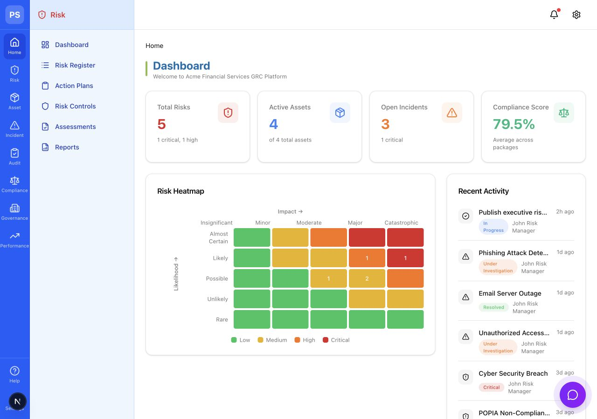
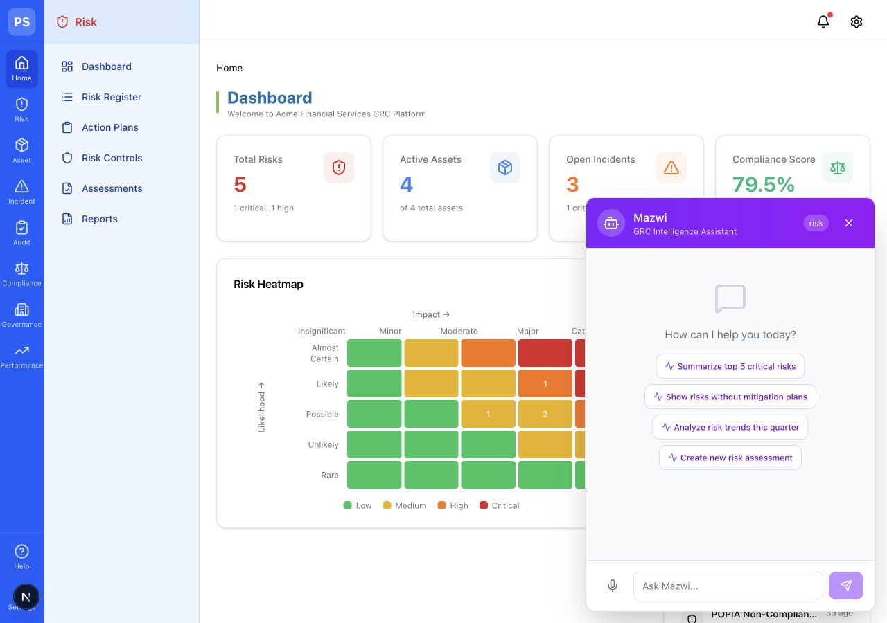

# Prosuite Chatbot Local Verification

## 2026-07-09

This verification focused on project proof for portfolio/GitHub use.

## Environment

- Next.js 16.1.6
- React 19.2.3
- TypeScript 5
- OpenAI SDK 6.17.0

## Commands Run

Install dependencies:

```bash
npm install
```

Result:

- Completed successfully.
- npm audit reported 9 vulnerabilities: 1 low, 4 moderate, 4 high.

Lint:

```bash
npm run lint
```

Result:

- Failed.
- Reported 61 total problems: 50 errors and 11 warnings.
- Main issue categories:
  - React compiler `set-state-in-effect` errors across CRUD/list pages.
  - React compiler `static-components` errors where components are created during render.
  - TypeScript/ESLint empty interface errors in UI components.
  - `no-explicit-any` errors in the AI context builder.

Build:

```bash
npm run build
```

Result:

- Failed during TypeScript validation.
- Current blocking error:

```text
src/lib/ai/actions/handler.ts:59
Object literal may only specify known properties, and 'priority' does not exist in type 'Partial<{ id: number; }>'.
```

Dev server:

```bash
npm run dev -- --port 3109
```

Result:

- Started successfully.
- Local URL: `http://localhost:3109`.
- `curl -I http://localhost:3109` returned `200 OK`.

## Browser Verification

Browser opened:

```text
http://localhost:3109
```

Verified dashboard:

- Page title: `ProSuite GRC Platform`.
- Dashboard renders.
- Sidebar/module navigation renders.
- Risk heatmap renders.
- Metrics cards render:
  - Total Risks: 5.
  - Active Assets: 4.
  - Open Incidents: 3.
  - Compliance Score: 79.5%.
- Recent activity renders.
- Module overview cards render.

Dashboard screenshot:



Verified Mazwi chat:

- Floating chat button renders.
- Mazwi chat panel opens.
- Chat panel identifies the assistant as `Mazwi`.
- Module badge shows `risk`.
- Risk-specific suggestions render:
  - `Summarize top 5 critical risks`
  - `Show risks without mitigation plans`
  - `Analyze risk trends this quarter`
  - `Create new risk assessment`
- Voice input button renders.
- Message input renders with placeholder `Ask Mazwi...`.
- Send button renders.

Chat screenshot:



## AI Provider Confirmation

Confirmed from code:

- Provider: OpenAI.
- Default model: `gpt-4o-mini`.
- Streaming route: `src/app/api/chat/route.ts`.
- The route builds a system prompt for Mazwi, adds live demo data from `src/data/prosuite-data.json`, then streams OpenAI chat completion chunks back as server-sent events.

Live assistant response was not triggered in this pass because sending a prompt would transmit data to the configured OpenAI account.

## Important Findings

- The visible product prototype is strong enough to use as portfolio proof with honest limitations.
- The README should position this as an AI/GRC prototype or hackathon project, not production software.
- The next strongest technical improvement is to make `npm run build` pass.
- The next strongest polish improvement is to run one approved non-sensitive AI demo and capture the streamed answer.
